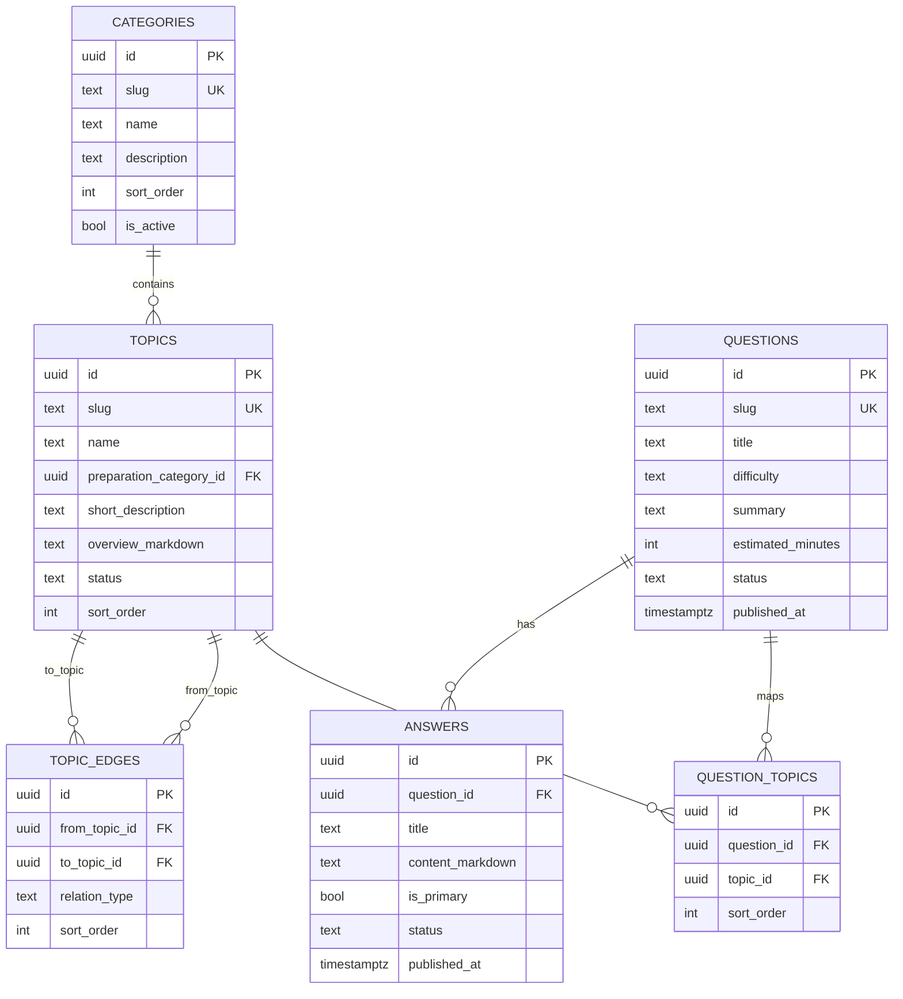
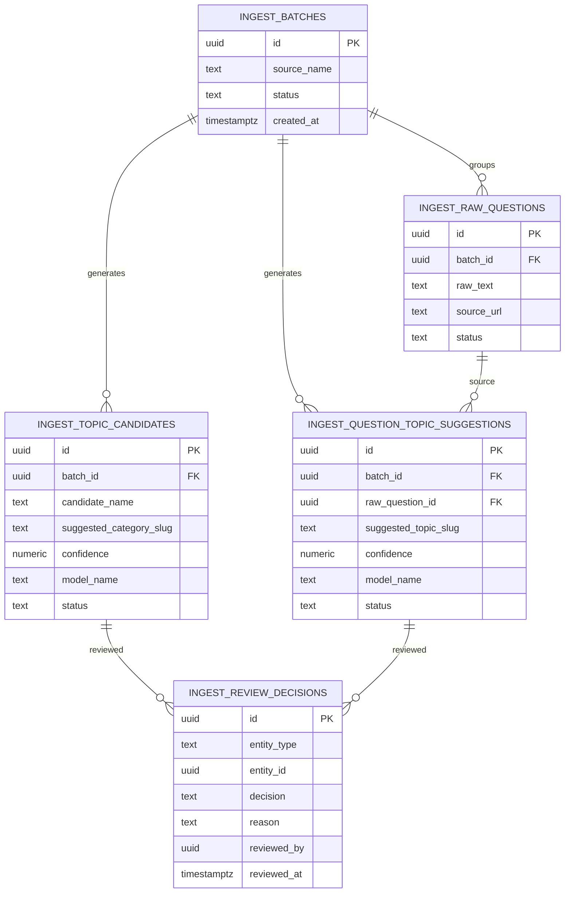

# Schema Diagram

This document visualizes the planned canonical schema and LLM-assisted ingestion staging flow.

## Canonical Content Schema (Post-Migration)

## LLM Ingestion Staging Schema (Human Review Gate)

## Visualizer

1. GitHub/GitLab Markdown viewer should render Mermaid blocks automatically.
2. For interactive editing, paste either Mermaid block into https://mermaid.live.
3. In VS Code, install a Mermaid preview extension to render this file locally.
